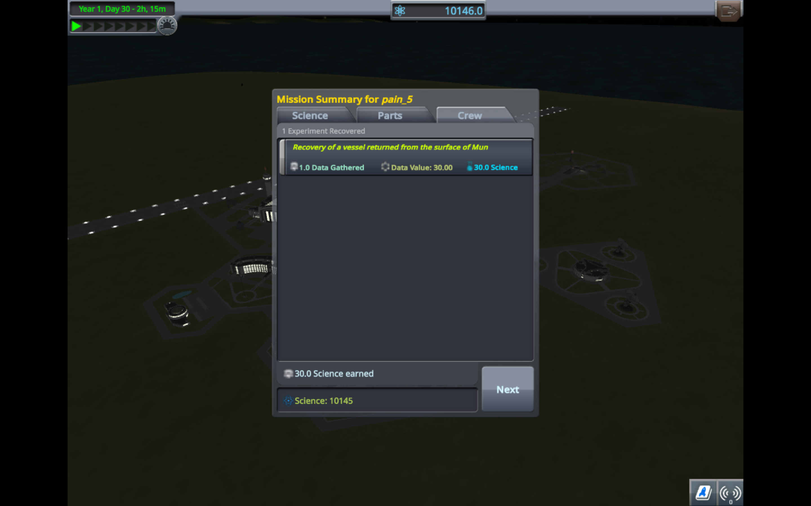
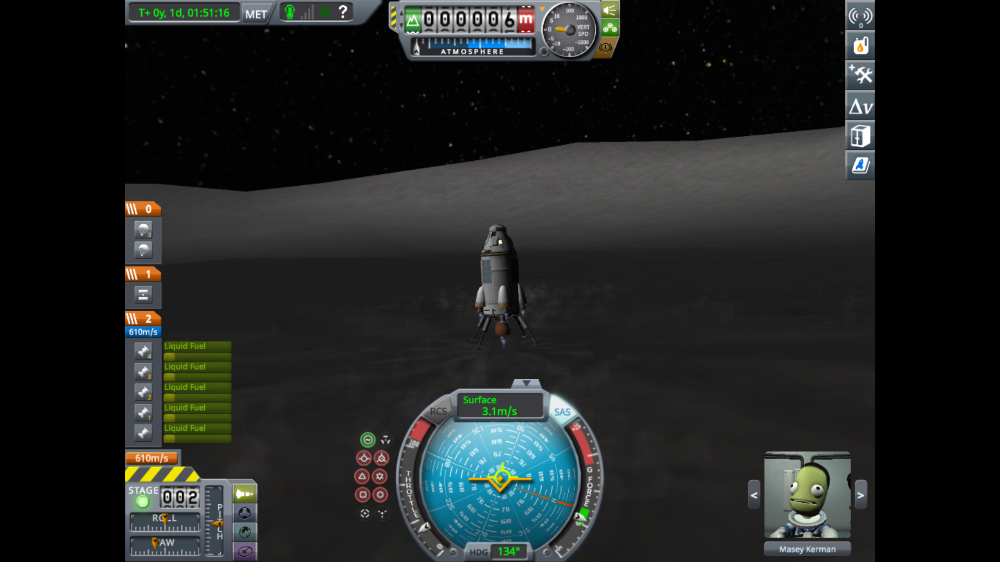

# Mission Report: Land on the Mun and Return
# By: Daniel Chuang

### Objective Overview:
The objective of this mission was to land on the Mun, which is the closest moon circularly orbiting Kerbin, and then return safely to Kerbin.

### Flight Events:
1. Rocket launch from Kerbin
2. Rocket gradual tilt, acquiring an >80,000m apoapsis.
3. Prograde burn at apoapsis to obtain circular orbit around Kerbin.
4. Prograde burn to gain escape velocity to enter the sphere of influence of the Mun.
5. Wait until at the periapsis of the Mun, then burn retrograde to obtain circular orbit around the Mun.
6. Burn retrograde very briefly to be on a collision course to the Mun.
7. Wait until around 4,000m height from the Mun, burn retrograde (anti-gravity turn) to slow down vertical and horizontal velocity.
8. Land on the Mun.
9. Explore!
10. Liftoff from the moon, then quickly turn 90 degrees until circular orbit around the Mun is reobtained.
11. Align and burn prograde to enter the sphere of influence of Kerbin. Enter very elliptical orbit.
12. Burn retrograde at Kerbin apoapsis to lower periapsis.
13. While entering atmosphere, face retrograde (so the heat shield can protect the command pod)
14. At around 3,000m height from sea level, activate parachute.
15. Land and recover spacecraft.

### Initial Difficulties and Analysis:
Since experience with entering orbit was already acquired through the second milestone mission, entering Kerbin orbit was not a major difficulty. Also, due to the amazing systems of the Kerbal Space Program which calculated when the Mun would be encountered, entering Mun orbit was not difficult either.

However, we encountered many difficulties during this mission. Primarily, there were three difficulties:
1. Having a rocket design with enough $\Delta V$ to reach the Mun & return.
2. Landing on the Mun.
3. Returning to Kerbin.

There were many attempts of landing at the Mun in which the spacecraft would fall over sideways, meaning that it was no longer able to take off. Moreover, when the spacecraft did land well, there was a lack of fuel, meaning that the spacecraft was stuck on the Mun. Finally, returning to Kerbin was a difficulty because there typically wasn't enough fuel left to do so.

Originally, the Rockomax branded rocket components were being employed (for four iterations). However, for the final iteration, smaller components were used, and they were very successful. 

### Design Solutions:
For 3 iterations, there were only 2 stages: one stage to get to orbit, and another stage to get to the Mun and back. However, this oftentimes lead to a lack of $\Delta V$ and a lack of balance, since there was a lot of excess mass from empty fuel tanks.

Another stage was added to transfer orbits from Kerbin to the Mun in the last two rockets, which allowed for sufficient $\Delta V$ to return back to Kerbin.

In the final iteration, fuel ducts were use to connect additional boosters on the side to the main rocket. This meant that the fuel on the side were used first, which allowed for the decoupling of those components to occur faster, providing more $\Delta V$.

Here was the final rocket design (called Pain5, adapted from [this video](https://www.youtube.com/watch?v=kMmiVegFTqU&ab_channel=MattLowne)):

##### Stage 1
- Mk16 Parachute
- Mk1 Command Pod
- Heat Shield 1.25m
- TD-12 Decoupler

##### Stage 2

- FL-T400 Fuel Tank + 2x (Z-100 Rechargable Battery Pack) + 2x (OX-STAT Photovoltaic Panels)
- LV-909 "Terrier" Liquid Fuel Engine + 3x (LT-1 Landing Struts)
- TD-12 Decoupler

##### Stage 3
- FL-T400 Fuel Tank
- LV-909 "Terrier" Liquid Fuel Engine
- TD-12 Decoupler

##### Stage 4
- FL-T800 Fuel Tank + 2x (TT-38K Radial Decoupler) + (Aerodynamic Nose Cone + FL-T800 Fuel Tank + FL-T800 Fuel Tank + LV-T30 "Reliant" Liquid Fuel Enginer)
- FL-T800 Fuel Tank + 2x (TT18-A Launch Stability Enhancer)
- LV-T30 "Reliant" Liquid Fuel Engine

### What I learned:
I learned about escape velocities, more about different rocket manuevers, how to land a spacecraft without a parachute, and more about rocket design.

### Going Forward:
Going forward, I will better plan my rockets and stages out instead of just brute forcing everything.
