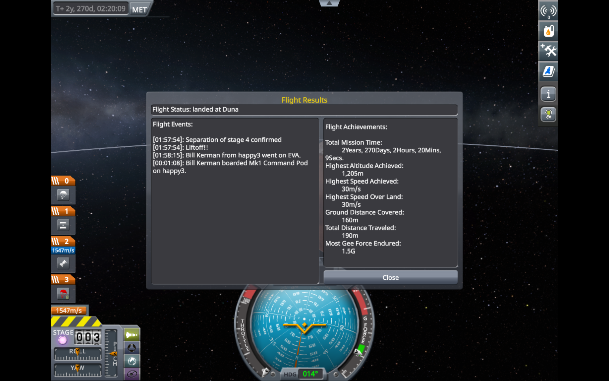
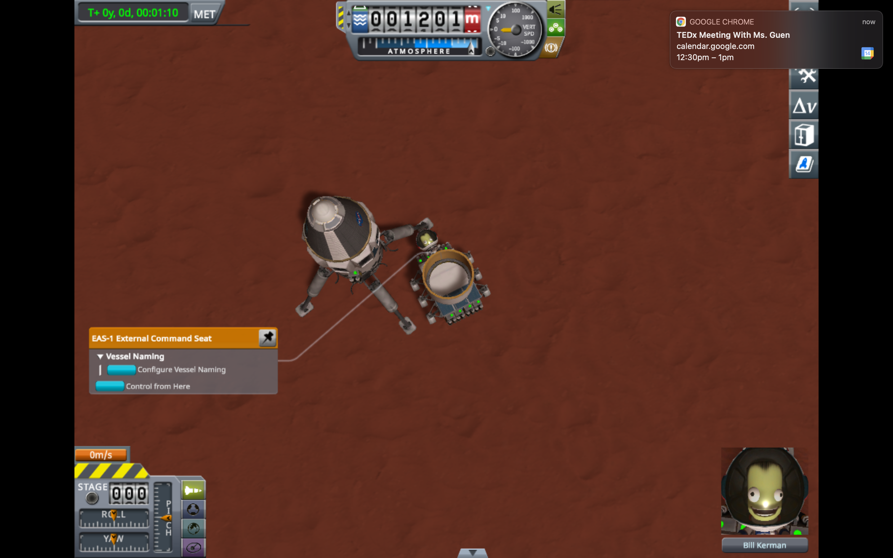

# Mission Report: Traverse Duna with a Rover

## By: Daniel Chuang

### Objective Overview

The objective of this mission was to send a rocket hosting a rover from Kerbin to Duna with a successful landing, allowing for the rover to explore the planet.

### Flight Events

1. Wait for launch window timing
2. Takeoff from Kerbin
3. Apoapsis above atmosphere achieved
4. Prograde burn to circularize Kerbin orbit
5. Transfer orbit from Kerbin orbit to Duna orbit
6. Enter the sphere of influence of Duna
7. Burn retrograde to slow down and enter a large circular orbit around Duna
8. Burn more retrograde until a Duna Periapsis of 20,000km is achieved
9. Wait for spaceship to slowly descend to Duna
10. Deploy parachutes at around 3000km above ground. (make sure that landing probes are expanded)
11. Wait for descent. Decouple rover from the bottom of the rocket to the ground
12. Allow astronaut to leave command pod to perform extravehicular activity. First, collect a sample from Duna and plant a flag. Then, use the astronaut to push the rover out from the bottom of the space ship, and then sit in the command seat of the rover.

### Initial Difficulties and Analysis

The challenge of this mission was primarily in the design of the rocket, as well as the transfer from Kerbin orbit to Duna orbit.

### Design Solutions

[Based off of your trials, what were some key design inspiration solutions that allowed you to complete the mission?]

### What I learned

[What are some things about rocket science, design, and spaceflight that you learned in the process of accomplishing this milestone?]

### Going Forward

[What are some things that you should keep in mind going forward? What are some changes you would make to this mission if you were to do it again? What parts of it were luck that should be turned into design?]
