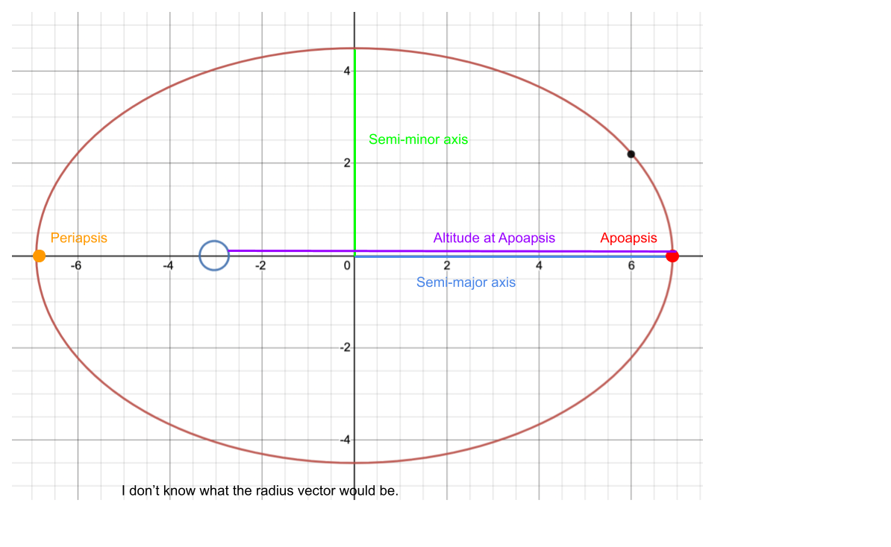

# Week 1: Orbits - Solutions
### Notes
#### Reference: Kepler's Laws
1. The orbit of a planet is an ellipse with the Sun at one of the two foci
2. A line segment joining a planet and the Sun sweeps out equal areas during equal intervals of time
3. The suqare of a planet's orbital period if proportional to the cube of the length of the semi-major axis of its orbit.

#### Kepler Problems: Level 1
##### Kepler's First Law
**1.1.1** An ellipse is a set of points such that the sum of the distances between any point in the set to the two foci is equal to an artibrary constant. The equation for an ellipse is as such: $$\frac{(x-h)^2}{a^2}+\frac{(y-k)^2}{b^2}=1$$ Regarding the relationship between circles and ellipses, circles are a subset of ellipses, which means that any shape that is a circle must also be an ellipse. One can think of a circle as an ellipse with overlapping foci.

The center of an ellipse is the point that is equidistant between the two foci with the smallest distance. The semi-minor axis is the distance between the center and the closest point on the ellipse (otherwise known as the co-vertex), while the semi-major axis is hte distance between the center and the farthest point on the ellipse (vertex).

_Image from [here](https://s3-us-west-2.amazonaws.com/courses-images-archive-read-only/wp-content/uploads/sites/923/2015/04/25181828/CNX_Precalc_Figure_10_01_0042.jpg)._

**1.1.2** Refer to solution to 1.1.

Regarding what foci are:
>An ellipse is a set of points such that the sum of the distances between any point in the set to the two foci is equal to an artibrary constant.

Regarding how they relate to a circle:
>One can think of a circle as an ellipse with overlapping foci.

**1.1.3**

**1.1.4**
The distance to the apoapsis of an ellipse from a foci is equal to the linear eccentricity of the ellipse (distance of foci to center) plus the semi-major axis. For the distance to the periapsis, it will simply be the semi-major axis minus the linear eccentricity.

For a perfect circle, the periapsis and the apoapsis will always be equal since the linear eccentricity is always equal to zero.

##### Kepler's Second Law
**1.2.1** You travel a lot further when you are close to the Periapsis compared to when you are close to the Apoapsis because the periapsis is closer to the center of Earth compared to the Apoapsis. Kepler's Second Law states that the area of the slice you travel over a duration of time from a certain location must be the same as any other location. Although it isn't exactly the case for elliptical orbits, area is generally porportionate to the height times width of a shape. As such, since your height at the Apoapsis is very high compared to your height at the Periapsis, the "width" (distance travelled along the orbit) must be smaller than the "width" at the Periapsis, where the height is lower. 

**1.2.2** The area of a circle is equal to $\pi r^2$, and a sector of the circle in porportion to time is equal to $\pi r^2 \cdot \frac{t}{t_{orbit}}$, where $t$ is equal to the amount of time that you travel and $t_{orbit}$ is equal to the total orbital time of the circle. Since the formula will be the same regardless of where you start on the circle, since the radius is constant, you will always travel at the same speed when in a perfectly circular orbit.

###### Kepler's Third Law
_**Reference**_ $\frac{T^2}{A^3}$
**1.3.1** $$\frac{365.25^{2}}{150000000^{3}}=\frac{687^{2}}{x^{3}}$$ $$x^{3}=\frac{687^{2}150000000^{3}}{365.25^{2}}$$ $$x=\left(\frac{687^{2}150000000^{3}}{365.25^{2}}\right)^{\frac{1}{3}} = 228561073.602$$